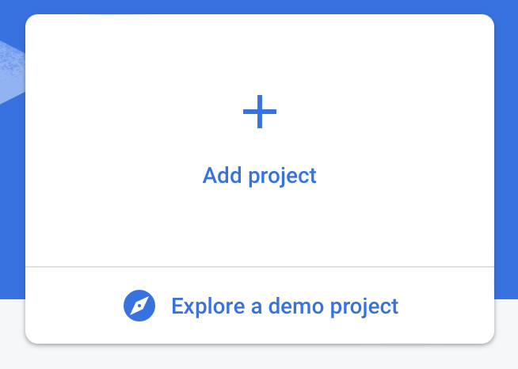
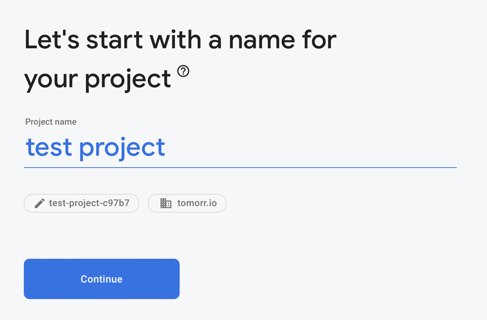
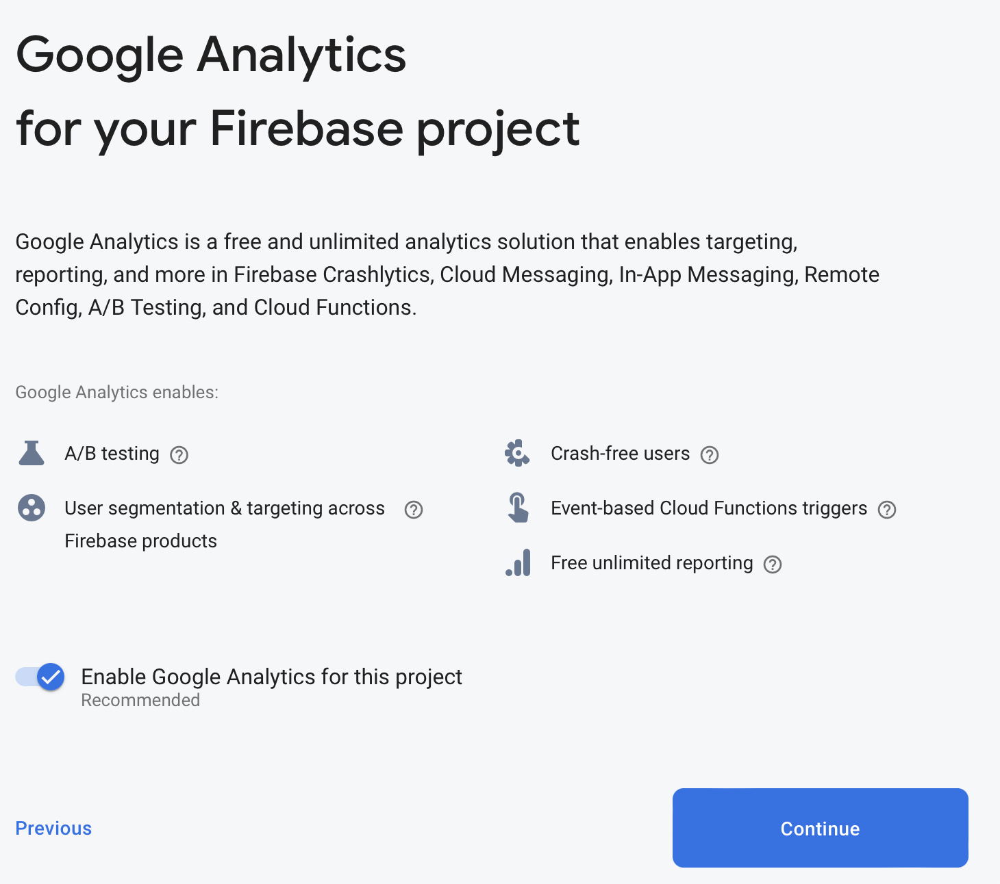
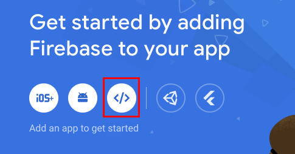
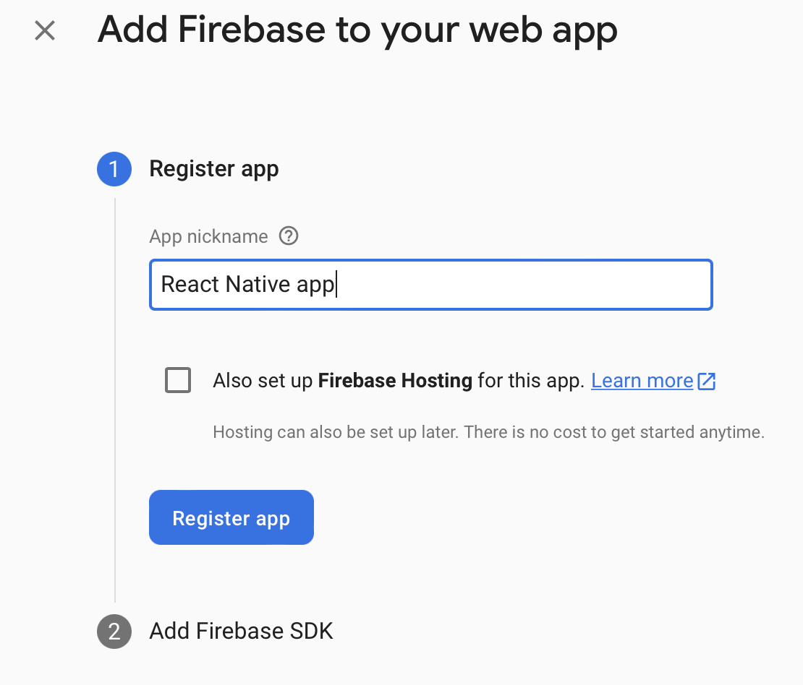
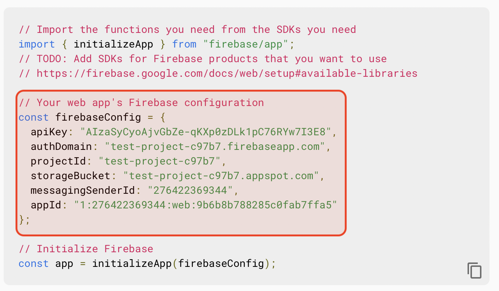

# ILUVUS - REACT NATIVE APPLICATION

<p align="center">

</p>

### Description

We're working on a social media app called ILUVUS, which focuses on celebrating racial minorities and marginalized communities like the LGBTQ+. Our goal is to connect these diverse communities in a world where discrimination and intolerance are still prevalent. ILUVUS aims to address this issue by promoting positivity, celebrating achievements, and combatting discrimination.

We're developing our own platform instead of using existing ones because they don't prioritize the celebration and recognition of these communities' accomplishments. Our focus is on offering a unique user experience that celebrates diversity. By doing this, we can ensure strict moderation of hateful posts and messages and promote positivity effectively.

## Getting Started

### Technology Stack:

-   **React Native**: A JavaScript framework for building mobile applications that can run on both iOS and Android platforms.
-   **Tailwind CSS**: A utility-first CSS framework for rapidly building custom designs.

### Dependencies

#### To build:

-   NodeJS
-   NPM
-   Firebase

#### To run:

-   Optional: Expo App on [iOS](https://apps.apple.com/us/app/expo-go/id982107779) and [Android](https://play.google.com/store/apps/details?id=host.exp.exponent&hl=en_US&gl=US&pli=1)
-   iOS Simulator on Mac OS only
-   Android Studio Android Simulator or any Android Studio on Mac OS, Windows, or Linux

### Connect with Firebase

#### Creating a Firebase project

Sign in with your Google Account. Once you’re in, you should see the Firebase console - click on the Add project button.



Give your project a name (whatever you’d like!):



Next you’ll be asked if you want to enable analytics - at the time of writing the Firebase SDK’s implementation of analytics does not work with React Native, however you can configure this separately using Expo’s FirebaseAnalytics - Expo Documentation package.



You’ll then have to wait a few seconds for Firebase to provision your new project…

### Add a Firebase web application



Give your app a nickname (whatever you’d like) and click Register app:



You’ll then see your Firebase credentials open up - copy the highlighted part into your clipboard and we’ll use this to create your Firebase configuration file.



Locate to the root directory, go to `src/utils`, create a file named `iluvus_bucket_credential.js`.

Replace the following `firebaseConfig = {}` with the highlighted part you copied above:

```javascript
import { initializeApp } from 'firebase/app'
import { getStorage } from 'firebase/storage'

const firebaseConfig = {
    apiKey: '',
    authDomain: '',
    projectId: '',
    storageBucket: '',
    messagingSenderId: '',
    appId: '',
    measurementId: '',
}

const app = initializeApp(firebaseConfig)
export const storage = getStorage(app)
```

### Connect to the backend

In the project root, create a file named `.env`, replace `BASE_URL` with the backend url:

```
BASE_URL=https://127.0.0.1:8080
```

### Installing & Execute

With the Firebase connection and connection to backend, the application is ready to build.

1. Use this link [https://nodejs.org/en/download](https://nodejs.org/en/download) to download and install NodeJS LTS version that is compatible with your Operation System.

2. Clone the ILUVUS React Native Repository:

```bash
git clone https://github.com/ILUVUS/iluvus-react-native-JIA-3317.git
```

3. Go to the repository directory on your Operation System. Install NPM packages

```bash
npm install
```

4. Build and run the application:

```bash
npm start
```

5. The output will prompt for which OS you would like to run:

-   `i` for iOS Simulator
-   `a` for Android Simulator

or scan the QR Code on the output with phone camera to run on Expo application.

# Release Notes

## Version 0.5.0

### New Features

-   Community Users can view videos in Media Viewer.
-   Community Users can create new post with videos.
-   Professional Users can view their Created Groups in its own view.
-   All Users can view their Following Groups in its own view.
-   Users can view their birthday on Profile page.
-   Live error indicators in Registration Form.
-   Communities are removed if a user account is removed from ILUVUS.

### Bug Fixes

-   Users could not get the relevant post properly on Home Screen after re-selecting interests.
-   User could not post Text only post.
-   Professional Users could not receive verification code.
-   Users must be 18 or older to sign up an account.
-   Community View buttons were flickery.
-   Reported post automatically removed once there is more than 5 reports.

### Known Issues

-   Login Form Scrollview does not scroll down properly.
-   Status bar text blends with background color.

## Version 0.4.0

### New Features

-   Users can receive notifications for uplifts, comments, tags, reports, and other types from communities.
-   Users can view the posts that are relevant to their interests in the newsfeed.
-   Users can select the interest topic when creating posts.
-   Added the profile page to display user information.
-   Users can select and edit their interests on the profile page.
-   Added users as moderators at the creating community view to manage reporting posts (keep or remove from the community).
-   Moderator users can view and accept or reject reporting posts.
-   Community owner can set profile pictures for their community at the creating point.

### Bug Fixes

-   Fixed the problem where notifications disappear.
-   Fixed the image display on the posts in the communities.
-   Change to switch button when asking for the professional or regular user at the registration screen.
-   The community list is displayed in order.

### Known Issues

-   The algorithm to sort the posts by interests sometimes goes wrong.
-   The post page is frozen if no images are selected.

## Version 0.3.0

### New Features

-   Users can now upload and share images along with their posts.
-   Users can view/zoom images in a post.
-   Implemented image processing capabilities such as resizing and compression.
-   Ability to tag other users in a post has been added.
-   Communities can now be set as either public or private.
-   Added a "Request Join" button for private communities.
-   Owners of private communities can now accept/decline join requests.
-   All login passwords are now hashed to increase security.
-

### Bug Fixes

-   Corrected the display of the number of likes/uplifts.
-   Fixed the problem where posts were not displaying properly.
-   Fixed the report button and added a report message when reporting.

### Known Issues

-   Users can tag people not in the community.

## Version 0.2.0

### New Features

-   Create text-only posts and display them on the community posts.
-   Like and dislike a post in a community.
-   Comment on a post in a community.
-   Report a post in a community.
-   Display the number of uplift(like) on the community posts.
-   Display the comment view on the community posts.

### Bug Fix

### Known Issues

-   Registration will navigate to verification screen even the user existed.
-   Verification page may send 2 emails.

## Version 0.1.0

### Features

-   Search community by the community’s name
-   View, and join community
-   Register inputs indicator
-   Date picker for Date of Birth input on Register screen

### Bug Fixes

-   Register new user with empty username and password
-   Create new community button did not show up
-   Verify does not work with userId

### Known Issues

## License

This project is licensed under the MIT License.

## Contributors:

-   [Arjun Ramani](#)
-   [Binaya Timsina](#)
-   [Doan Tran](#)
-   [Thuan Vo](#)
-   [Tyler Lin](#)

## Acknowledgments

Ideas, Inspiration, and Project belong to [James Elliott](#)
